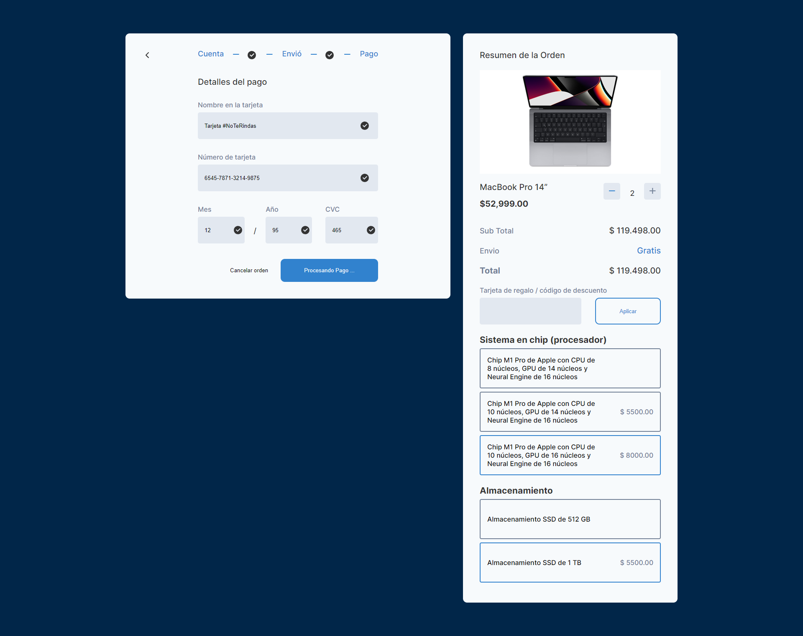
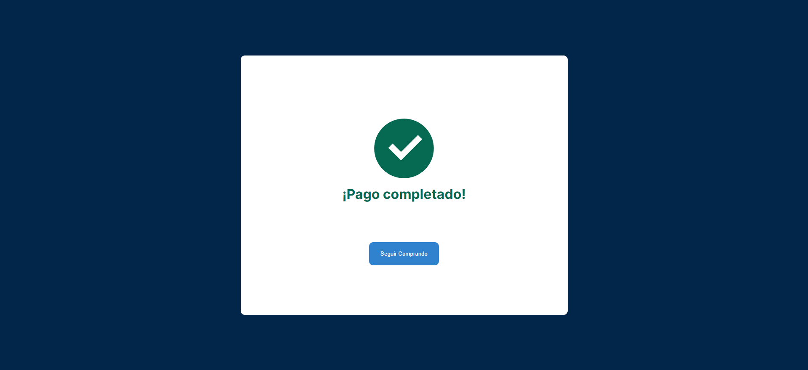
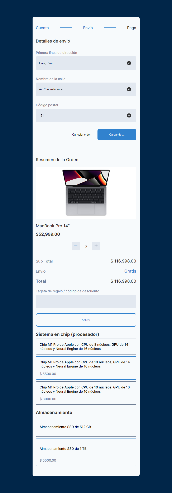

# Checkout Responsive
Construye un flujo efectivo y funcional para la compra de todo tipo de productos.

Un proyecto complejo en mi opinion, que se me hizo dificil en cierta parte, pero pude lograrlo con mucha determinacion, me gusto mucho el resultado.

## Requerimentos
Estilo libre. Lleva el diseño al código utilizando tu framework favorito, o con HTML y CSS, no hay ninguna limitación.

- Cubre todas las resoluciones del diseño
- Aplica efectos y transiciones a tu gusto
- Personaliza el color si lo deseas
- Sube tu código a GitHub
- Publica tu resultado con github pages
- Mándalo a revisión desde tu [perfil](https://leonidasesteban.com/estudiante)

## Desktop

## Mobile

